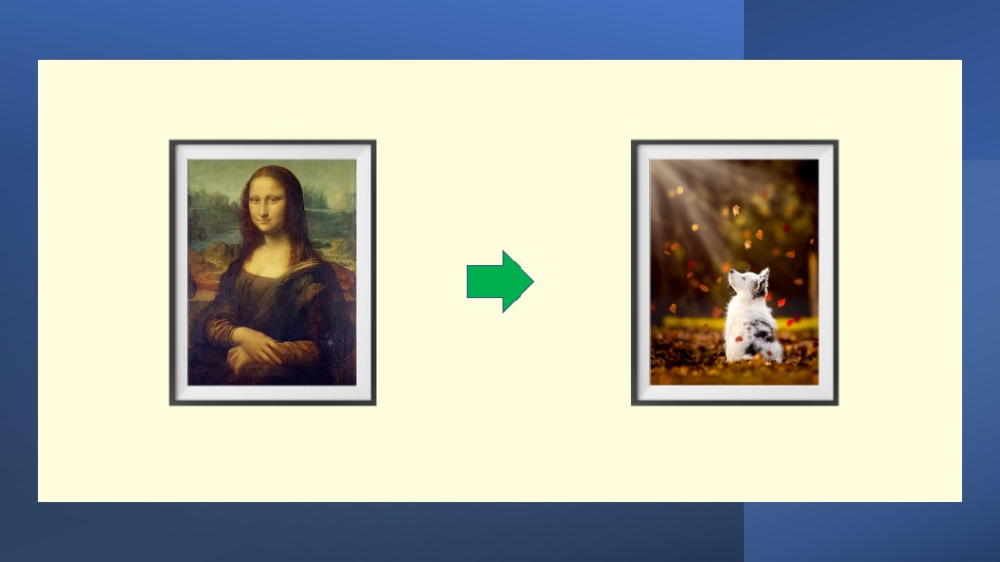
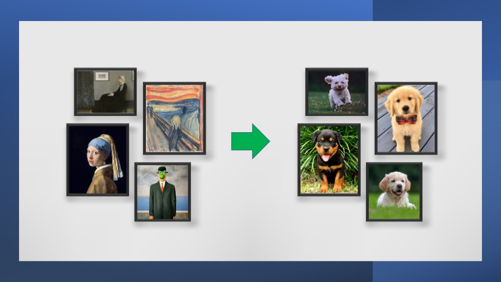

*This is a ML/AI - Computer Vision take-home style assignment for tychon candidates*

# Painting Swap

## 1. The Problem

The problem is to locate paintings and swap them for cute puppy pictures. 

Develop a Computer Vision program which takes in a set images. For each image you are required to locate each of the paintings within the images, and swap each painting with a random puppy image in its place. The swapped image must sit within the painting frame as if it were the original painting.  

The walls of the galleries in the images are assumed to be a single colour, as is usual in an Art gallery so as to not distract from the art. This assumption helps to detect the non-wall components of the gallery image.  

The paintings are also assumed to be somewhat rectangular (*somewhat* specifically meaning that they take up 60% of their bounding rectangle in the image). This assumption helps to eliminate parts of the wall and ceiling that may be in the gallery image.

## 2. Submission Instructions

Using the images in the data folder, complete the challenage by generating your replaced images in the output folder. 

Commit your final version to your own Github repository. 

Email your repository link containing your solution.
